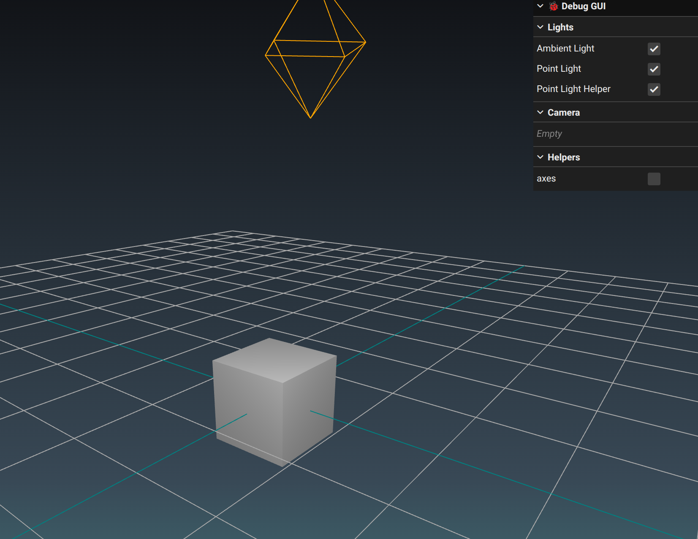

# Three.js Vite Template with TypeScript

Three.js + Vite + TypeScript starter

---



---

## ⚡ Quick Cloning Command

From [Community Notes - Getting Started | Vite](https://vite.dev/guide/#community-templates)

```bash
npx degit Made-of-Clay/vite-threejs-ts-template my-project
cd my-project
# my version of project init deviates this way
pnpm i
pnpm dev
```

## Tech Stack

- Three.js
- TypeScript
- Vite


## CLI Commands

Installation

```bash
pnpm i
```

Run dev mode

```bash
pnpm dev
```

Build

```bash
pnpm build
```

Run build

```bash
pnpm preview
```
